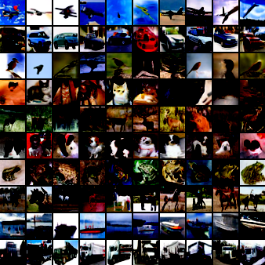

# JitNoise：基于Jittor的DDPM复现与改进

 

> 基于DDPM的跨框架实现，包含Jittor/PyTorch双版本及创新方案

## 📚 项目简介
本项目对[DDPM](https://arxiv.org/abs/2006.11239)论文进行了多框架复现与改进：
- [ 我对DDPM的理解与项目部分代码讲解（23分钟）](https://www.bilibili.com/video/BV1KiLkzXEHR/)

## 🎨 效果展示

### 使用本项目中JitNoise进行测试
<table>
  <tr>
    <td align="center"></td>
    <td align="center"></td>
  </tr>
</table>

### 使用本项目中cJitNoise进行测试



## 📂 仓库目录说明

### 1️⃣训练脚本
- **Jittor实现版本**：[JitNoise.py](https://github.com/zyxiang2004/JitNoise/blob/main/JitNoise.py)
- **PyTorch原始版本**：[pytorch_ddpm.py](https://github.com/zyxiang2004/JitNoise/blob/main/pytorch_ddpm.py)
- **条件创新版本**：[cJitNoise.py](https://github.com/zyxiang2004/JitNoise/blob/main/cJitNoise.py) → *需要将代码结尾main函数修改为train模式后运行*
### 2️⃣测试脚本
- **JitNoise测试**：[test.py](https://github.com/zyxiang2004/JitNoise/blob/main/test.py)
- **cJitNoise测试**：[cJitNoise.py](https://github.com/zyxiang2004/JitNoise/blob/main/cJitNoise.py) → *注：直接运行，RTX4090上单次测试花费约六分钟*
### 3️⃣数据准备脚本
- **无需单独运行**：[prepare_cifar10.py](https://github.com/zyxiang2004/JitNoise/blob/main/data/prepare_cifar10.py)
### 4️⃣训练好的模型
- **训练了1000epochs的JitNoise模型**：[jittor_cifar10_1000epochs.jt](https://github.com/zyxiang2004/JitNoise/blob/main/jittor_cifar10_1000epochs.jt)
- **训练了90epochs的cJitNoise模型**：[ckpt_90.pkl](https://github.com/zyxiang2004/JitNoise/blob/main/ckpt_90.pkl)
## 📊 训练监控
查看训练过程指标记录：
- **[三方日志对齐分析]**：[zyxiang2004.ipynb](https://github.com/zyxiang2004/JitNoise/blob/main/zyxiang2004.ipynb)
- **[Loss曲线可视化]**：[loss_curve.png](https://github.com/zyxiang2004/JitNoise/blob/main/logs/loss_curve.png)
- **[完整训练日志]**：[training.log](https://github.com/zyxiang2004/JitNoise/blob/main/logs/training.log)
- **[生成图像/噪声的示例]**：[samples](https://github.com/zyxiang2004/JitNoise/tree/main/samples)

## 🚀 快速开始

### 在[AutoDL算力云](https://www.autodl.com/)平台上进行环境配置

```bash
# 选择配置：RTX 4090 + PyTorch 2.0.0 + Python 3.8 + CUDA 11.8
# 进入终端，逐条执行下列指令
source /etc/network_turbo  # 启用网络加速
source activate base

curl -s https://packagecloud.io/install/repositories/github/git-lfs/script.deb.sh | sudo bash
sudo apt-get install git-lfs
git lfs install

git clone https://github.com/zyxiang2004/JitNoise.git
git clone https://github.com/Jittor/jittor.git

cd jittor 
pip install .
cd ..
cd JitNoise

python test.py  # 测试JitNoise
python cJitNoise.py # 测试cJitNoise,可能花费约6分钟时间
```

## 🔗 相关链接
- [📜 原理论文](https://arxiv.org/abs/2006.11239)
- [💻 Jittor官方库](https://github.com/Jittor/jittor) 
- [📺 视频讲解](https://www.bilibili.com/video/BV1KiLkzXEHR/)

#### 如果你喜欢我的工作，欢迎引用：[DOI:10.12074/202503.00181](https://chinaxiv.org/abs/202503.00181)
